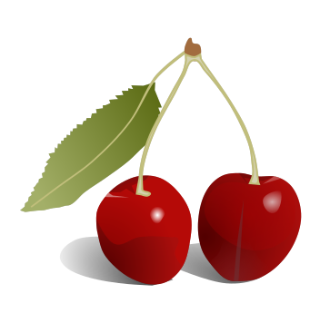
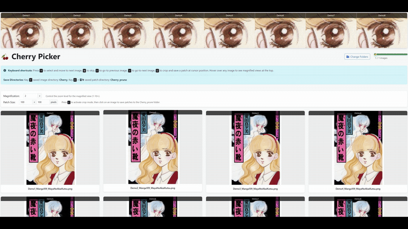

# 🍒 Qualitative Data Cherry Picker

<div align="center">



[](https://www.python.org/downloads/)
[](https://opensource.org/licenses/MIT)
[](https://github.com/SimonZeng7108/Cherry-Picker/stargazers)

**A web-based application for cherry-picking images across multiple folders for comparison and analysis.**



</div>

---

## 📋 Table of Contents
- [🍒 Qualitative Data Cherry Picker](#-qualitative-data-cherry-picker)
  - [📋 Table of Contents](#-table-of-contents)
  - [✨ Features](#-features)
  - [🔧 Requirements](#-requirements)
  - [📥 Installation](#-installation)
  - [🚀 Usage](#-usage)
  - [📝 Notes](#-notes)
  - [📜 License](#-license)
  - [📌 To-do List](#-to-do-list)
  - [📚 Citation](#-citation)

---

## ✨ Features

- 🖥️ Modern web interface for comparing images from 8 different folders
- 📱 Responsive grid layout that adapts to different screen sizes
- ⌨️ Keyboard shortcuts for quick cherry-picking (Y for yes, N for next)
- 📊 Progress tracking to see how many images you've reviewed
- 📁 Automatically copies selected images to a "Cherry" folder with proper naming
- ✂️ Crop functionality to extract and save patches from all images at the same relative position

---

## 🔧 Requirements

- Python 3.7+
- Modern web browser (Chrome, Firefox, Edge recommended)
- Image folders arranged as described below

---

## 📥 Installation

1. Clone this repository
   ```bash
   git clone https://github.com/SimonZeng7108/Cherry-Picker.git
   cd Cherry-Picker
   ```

2. Install the required dependencies:
   ```bash
   pip install -r requirements.txt
   ```

---
```

**📂 GroundTruth**
- 🖼️ **Image1.png**
- 🖼️ **Image2.png**
- 🖼️ **Image3.png**

**📂 Model1**
- 🖼️ **Image1.png**
- 🖼️ **Image2.png**
- 🖼️ **Image3.png**

**📂 Model2**
- 🖼️ **Image1.png**
- 🖼️ **Image2.png**
- 🖼️ **Image3.png**

**📂 Cherry**
- 🖼️ **GroundTruth_Image1.png**
- 🖼️ **Model1_Image1.png**
- 🖼️ **Model2_Image1.png**

**📂 Cherry_prune**
- 🖼️ **GroundTruth_Image1_xCENTER_yCENTER_WIDTHxHEIGHT.png**
- 🖼️ **Model1_Image1_xCENTER_yCENTER_WIDTHxHEIGHT.png**
- 🖼️ **Model2_Image1_xCENTER_yCENTER_WIDTHxHEIGHT.png**
```

## 🚀 Usage

1. Run the application:
   ```bash
   python cherry_picker_web.py
   ```

2. Open your web browser and navigate to: http://127.0.0.1:5000/

3. Use the interface to review images:
   - Press the "Select" button (or Y key) to save images to the Cherry folder
   - Press the "Skip" button (or N key) to move to the next set of images
   - Press the C key to activate crop mode, then click on an image to extract patches

4. All selected images will be saved to the "Cherry" folder with the naming convention: 
   ```
   folder_dataset_imagename
   ```

5. Using the crop functionality:
   - Set the desired patch size in the "Crop Patch Settings" section
   - Press the C key to activate crop mode
   - Click on any image to crop patches from all displayed images at that relative position
   - Cropped patches are saved to the "Cherry_prune" folder
   - Patches are named following the convention: 
     ```
     folder_filename_xCENTER_yCENTER_WIDTHxHEIGHT.png
     ```

---

## 📝 Notes

- All folders must contain the same structure and image file names for proper comparison
- First selected folder will be used as the source for the full file name list

---

## 📜 License

This project is open source and available under the [MIT License](LICENSE).

---

## 📌 To-do List

- [ ] Add a button to save and keep a text note on why the image was selected
- [ ] Create a text file to store the cherry-picked image names
- [ ] Convert the code to an executable file using Nuitka

---

## 📚 Citation

If you use Cherry Picker in your research, please cite it as follows:

```bibtex
@article{cherry_picker,
  title={Cherry Picker: A web-based application for cherry-picking qualitative data},
  author={Simon Zeng, Siyue Teng, Yuxuan Jiang, Aaron Zhang},
  year={2025},
  link={https://github.com/SimonZeng7108/Cherry-Picker}
}
```

---

<div align="center">
  <sub>Built with ❤️ by Simon Zeng, Siyue Teng, Yuxuan Jiang, and Aaron Zhang</sub>
</div>
